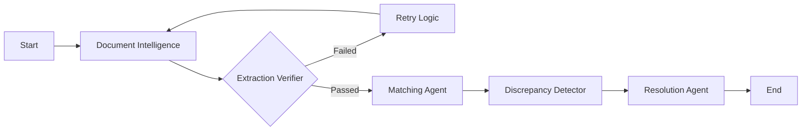

# 🛡️ SafePay

**SafePay** is a production-inspired, **agentic invoice reconciliation system** that automates the verification of supplier invoices against purchase orders (POs).

Rather than relying on brittle, linear automation pipelines, SafePay is built as a **self-correcting multi-agent system** that can reason under uncertainty, recover from extraction errors, and make **financially conservative decisions** when processing real-world, messy documents.

This project was built as a **self-initiated personal exploration** into agentic AI, document intelligence, and explainable decision-making for financial workflows.

---

## 🌟 Key Capabilities

### 🔄 Self-Correcting Agent Loop  
A dedicated **Extraction Verifier Agent** performs deterministic mathematical validation on extracted line items.

- If `quantity × unit_price ≠ line_total`, extraction is rejected  
- The workflow loops back and forces re-extraction  
- Prevents silent OCR or parsing errors from propagating downstream  

---

### 🧠 Hybrid PO Matching (Exact + Fuzzy + Semantic)  
The **Matching Agent** combines:
- **Exact PO reference matching**
- **Fuzzy string matching** (supplier names and product descriptions)
- **Vector similarity search (FAISS + sentence-transformers)**

This allows SafePay to recover gracefully when:
- PO references are missing
- Supplier names vary
- Line items appear in different orders  

---

### 🛡️ “Humble” Confidence Modeling  
SafePay explicitly models uncertainty instead of assuming perfect automation:

- Scanned or rotated invoices automatically **cap confidence scores**
- Clean, machine-readable PDFs receive higher confidence
- Confidence directly influences approval vs escalation decisions  

The system always prefers **escalation over false approval**.

---

### ⚡ Resilient by Design  
SafePay is built with production realities in mind:
- Exponential backoff for LLM calls
- Checkpointed agent state
- Safe retries without corrupting execution flow  

---

### 📊 Full Observability  
Every agent action is logged into a **granular execution trace**, including:
- Agent name
- Duration
- Confidence
- Decision status  

A **Streamlit dashboard** visualizes the full reasoning process, acting as a control tower for audits and debugging.

---

## 🏗️ Architecture

SafePay is implemented using **LangGraph**, modeling the workflow as a **state machine**, not a linear pipeline.



---

## 🧠 Agents Overview

### 📄 Document Intelligence Agent
- Extracts structured data from clean and scanned PDFs  
- Handles rotations, stamps, and noisy layouts  
- Outputs field-level confidence scores  
**Model:** Gemini 

---

### 🧮 Extraction Verifier Agent
- Deterministic math checks:
  - `Qty × Unit Price = Line Total`
  - Subtotal consistency  
- Forces re-extraction when inconsistencies are detected  

---

### 🔍 Matching Agent
- Primary: Exact PO reference  
- Secondary: Supplier + product fuzzy matching  
- Fallback: Product-only semantic similarity (FAISS)  

Produces **ranked PO hypotheses with confidence scores**.

---

### 🚨 Discrepancy Detection Agent
- Audits:
  - Price variances
  - Quantity mismatches
  - Missing PO references  
- Assigns severity and confidence per discrepancy  

---

### ✅ Resolution Agent
Synthesizes all upstream evidence and recommends one of:
- `auto_approve`
- `flag_for_review`
- `escalate_to_human`  

Decisions are **confidence-driven**, not rule-forced.

---

## 🚀 Quick Start

### Prerequisites
- Python **3.10+**
- Google **Gemini API Key**

---

### 1️⃣ Clone & Setup

```bash
git clone https://github.com/Rajesh-007-dl/SafePay-Agent.git
cd safepay
```

Install dependencies (recommended):

```bash
pip install uv
uv sync
```

Or using pip:

```bash
pip install -r requirements.txt
```

---

### 2️⃣ Configure Environment

Create a `.env` file in the project root:

```bash
GOOGLE_API_KEY="your_actual_api_key_here"
```

---

### 3️⃣ Run the Pipeline

Processes all invoices in `data/invoices/` and generates structured JSON results.

```bash
uv run main.py
```

---

### 4️⃣ Launch the Dashboard

Visualize agent decisions and execution traces:

```bash
uv run streamlit run dashboard.py
```

---

## 🧪 Scenarios SafePay Handles Well

| Scenario | System Behavior |
|--------|----------------|
| Math inconsistency | Forces re-extraction |
| Scanned / rotated invoice | Lowers confidence |
| Hidden price increase | Flags specific discrepancy |
| Missing PO reference | Infers PO via semantic search, escalates |

---

## 📂 Project Structure

```text
├── src/
│   ├── agents/              # Individual agent logic
│   ├── database.py          # FAISS vector store + PO loader
│   ├── graph.py             # LangGraph orchestration
│   └── state.py             # Shared AgentState definition
│
├── data/
│   ├── invoices/            # Input invoice PDFs
│   └── purchase_orders.json # PO database
│
├── output/                  # Generated JSON results
├── main.py                  # Pipeline entry point
├── dashboard.py             # Streamlit visualization
└── requirements.txt
```

---

## 📌 Design Philosophy

- Accuracy > automation  
- Escalation > silent failure  
- Explainability > black-box decisions  
- Agents > scripts  

---


